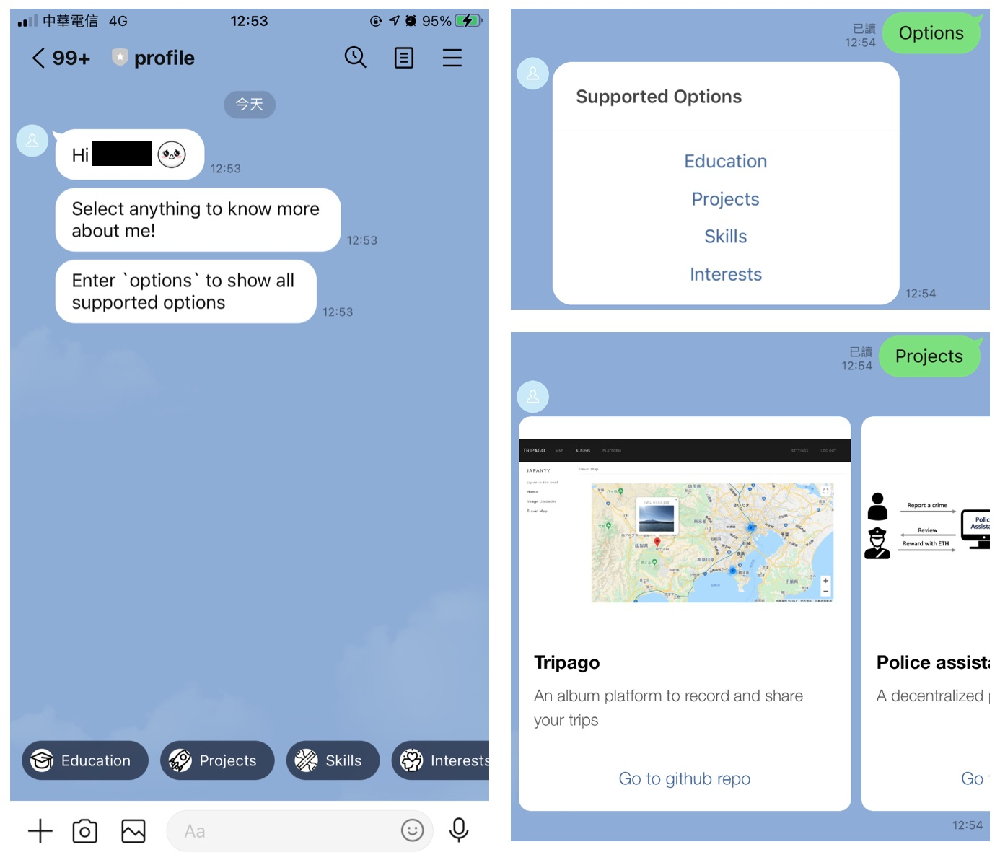

# Profile Chatbot

## Deployment
Deploy on Google App Engine

## Supported Options
- `options`: show all supported options
- `educations`: my educational background
- `projects`: selected projects
- `skills`: my skills
- `interests`: my interests

## Screenshots

## Development
Have to uncomment ngrok stuff (line 4, line 239-247) in `server.js` to run on local server, and need to update Webhook URL in line developer console.
